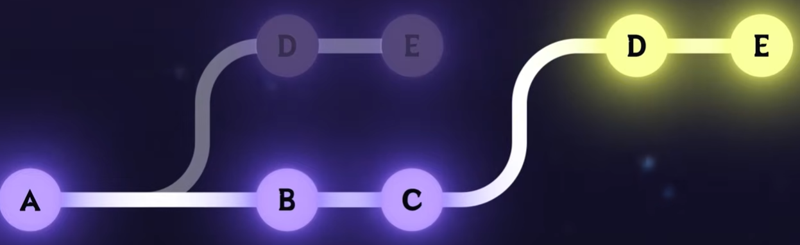

$ ```Porcelain commands``` are the user-friendly, high-level commands we use every day.

$ some porcelain commands are::
```git 
git init 
git clone 
git add 
git commit 
git status 
git push 
git push 
git pull 
```
---
- to set main as default branch
```
git config --global init.defaultBranch main
```
---
<h5>every thing related to any repository and all details are stored in <a>.git</a> folder/repository </h5>

- to start a git project :
    - create a repo 
    ``` mkdir repoName```
    - cd to repo and initialise git in it 
    ```  cd repoName && git init```
    - some important states of any git repository
        
        - ```untracked =>> not being tracked by git```

        - ```staged =>> marked to be added with next commit```

        - ```commited =>>saved/changes done to the repo``` 

        - ```git status ``` is the command used to check current state
    - add git files to stage using ``` git add <fileName> ```

    - ``` git add . ``` to stage all the files in current directory

---
<h4>git commit</h4>

- commit is a snapshot of a repo at a given point of time
- git stores the entire history per commit
* it does not save diffs(differences) 
- to commit a file :
    ``` git commit -m "your text Message"```
- ``` git commit --amend -m "new message" ``` is useful for changing the last done commit message
- ``` git log ``` it shows:
    - who made the commit 
    - what was changed 
    - when was the change done / when was the commit done
- ``` git log --oneline ``` to see all the commit logs in oneliner format

- ``` git log -n 10``` logs last 10 commits
- ``` git log --graph``` logs in graphical representation (shows how different branches and commits behave)

---
- ```git hashes``` are autogenerated at/by each commit made by the user
    (hashes are nothing but pointers to other files or things)

- git hash collisions are only happen if you commit by the same changes by same user at same time(rarely occurs)
    (author's text editor doesn't affect the hashes of any commit )
---
Git is made up of objects that are stored in the ```.git/objects``` directory. A commit is just a type of object.

```git cat-file -p(shows the changes made) <hash>``` (it is a pluming command) to read the content of any hash
use ```git cat-file -p <hash> ``` on:
 - a tree(a tree is a way to store a directory)
 - a blob(a blob is a way to store a file):

        on a tree : gives the blob
        on a blob : gives the file details
        on file details : gives the commit message(s)

---
<h3>git config</h3>

- ``` git config --add --local <key>.<section> <Value> ```

e.g. :
```
git config --add --local sahil.fullname SahilBhankhor
git config --add --local sahil.alternateMail SahilBhankhor02@gmail.com
```

access any value from the key :
``` git config --get <key>(i.e. sahil.username etc..)```

---
<h3>git branchings</h3>

``` git branch ``` is used to check/list all current branches

``` git branch -m oldName newName``` is used to rename any git branch

- 2 ways to create a branch

    ``` git branch new_branch``` creates new branch but does not switch in it

    ``` git switch -c <new_branch>``` creates and switchs to the new branch

    ---
- to change between branches use
    ``` git switch branchName ``` or
    ``` git checkout -b branchName```  

    ---
Log Flags

``` git log oneline ``` (A onelines that shows only necessary info)

``` git log --decorate=full``` (shows the full ref name)
    
``` git log --decorate=short``` (default)
    
``` git log --decorate=no``` (no decorations)

---
<b>git merge and merge-commits</b>


``` git merge <branchName> ``` is used to merge the \<branchName> into the main branch 

to remove any merged branch use ``` git branch -D <branchName> ```.
this will delete the branch from the git track/logs

for visual representation after the merger use 
``` git log --oneline --decorate --graph --parents```

if any current node shows 2 parents(2 or more hashes/pointers) , then that node is a merged commit

---
<b>git rebase </b>


git rebase allows to take any branch and add it to the tip of the main branch

it simply moves the merge base to the tip of the main branch  

``` git rebase <branchToREBASE>``` rebases '\<branchToREBASE>' to your current working branch(the branch you are on , currently)

---
$ git reset (soft reset and hard reset)

- the "git reset" command can be used to undo the last commit(s)

- ```git reset --soft COMMITHASH ``` turns the previous commit but keeps all the changes
- it changes the last commited changes to uncommitted and keeps the current uncommitted changes as same as they are currently

can also use  ```git reset --soft HEAD~n ``` where n is the number of steps you want to go back

``` git reset hard *(CommitHash)``` will undo the index od current working tree ( it will reset the last commit done) { completely removes the changes from the branch }
 
# <h3>Git remote</h3>
A remote is just another repo to git. So, it can also be local (on the device)

``` git remote add <Remote_Name> <URI> ```
 
 - create a local git remote
 - create a git-initialised repo and cd into it.
  do ```git
   git remote add origin(Name) /path/to/realRepo ``` (must perform from remote repo)
 - ``` git log (RemoteName)/(BranchName) ``` to see the diffs b/w origin and any branch (must perform from remote repo)
 - ~~~git 
    git merge origin/main && git log 
    ~~~ 
    to save all the updates to the remoteRepo